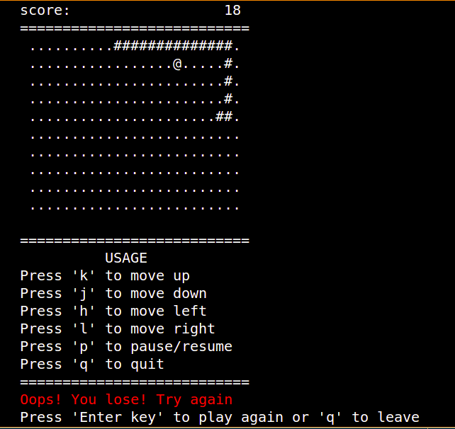

# Console Snake



Console Snake is a simple snake game written in C for Posix platforms.

It allows users to play the classical snake game directly in the terminal. It uses ASCII characters for rendering and user input.

# Prerequisites
- Posix platform (Linux, macOS, ...)
- C compiler ([clang](https://clang.llvm.org/))

# Quick start 
## Clone the repository
```console
$ git clone https://github.com/diskouna/console_snake.git
```
## Build and run the project
 
```console
$ cd console_snake
$ clang -Wall -Wextra -Werror -O2 -std=c11  console_snake.c -o console_snake && ./console_snake
```
If you have "make", you can just run : 
```console
$ cd console_snake
$ make
```
# LICENCE
This project is under the MIT Licence. See the [LICENCE](LICENCE) file for details.